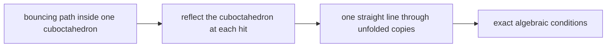
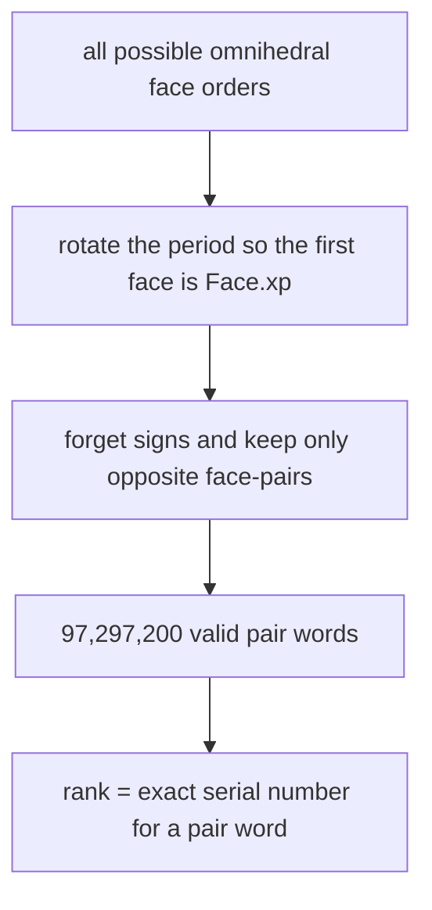
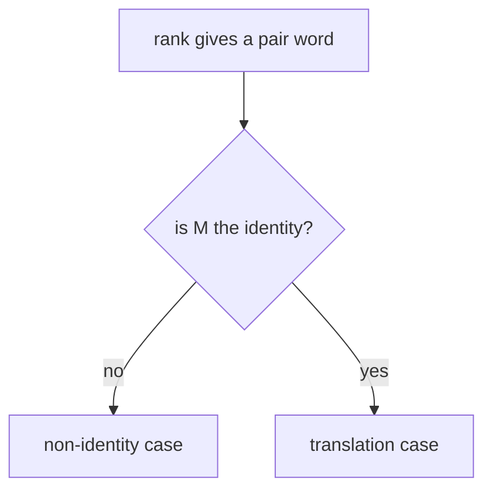
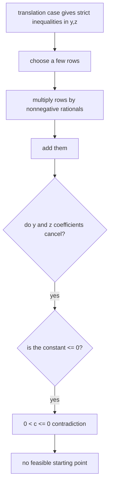
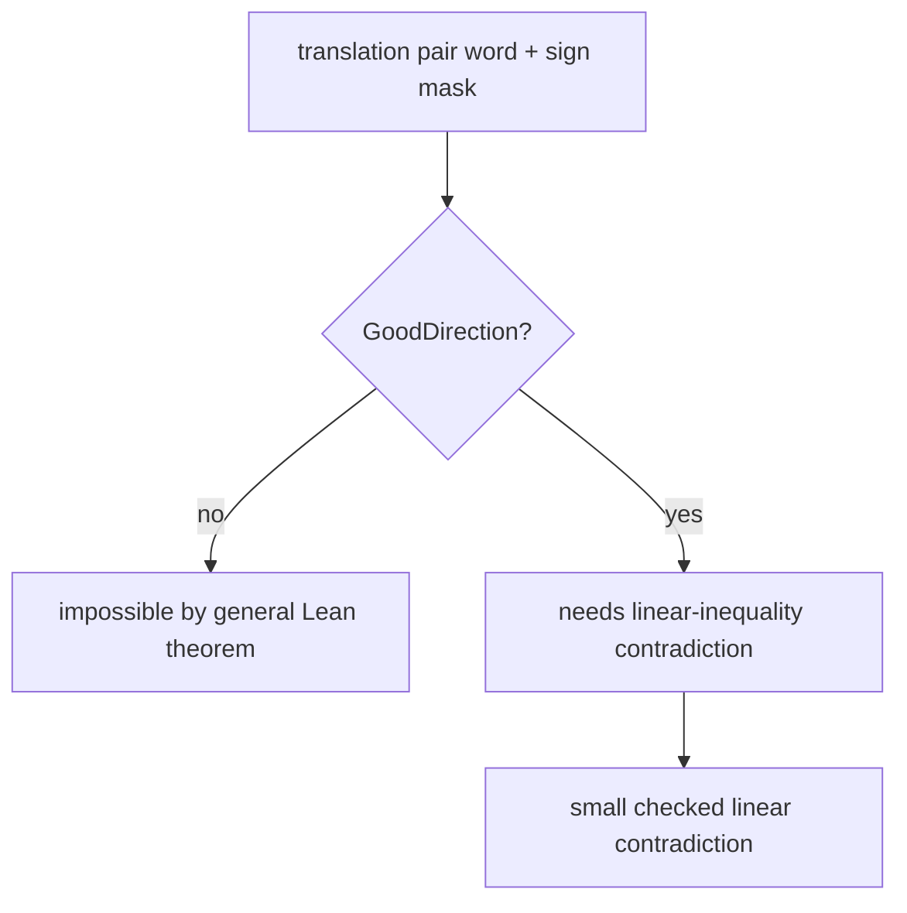
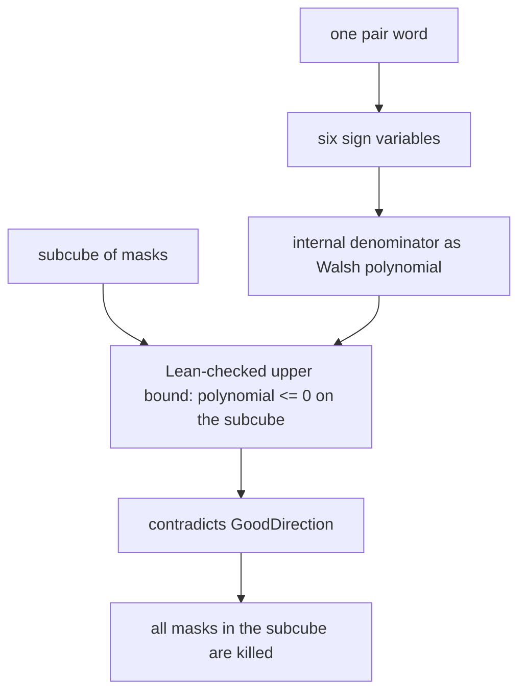
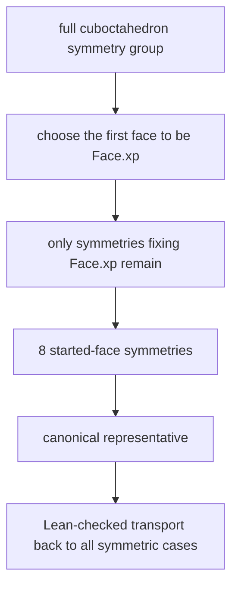
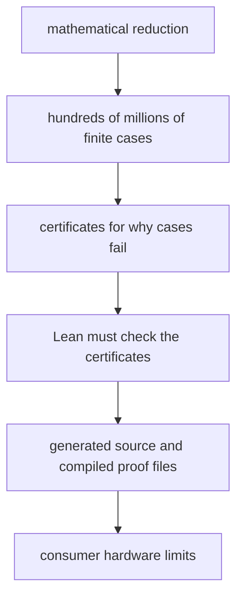
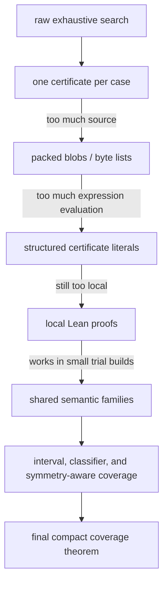
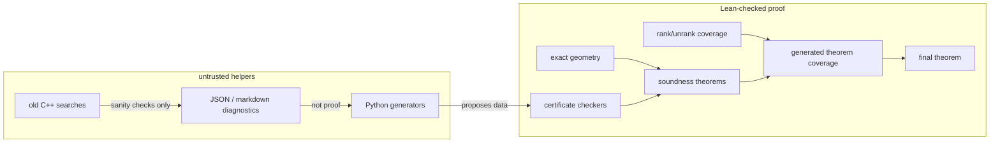

# Cuboctahedron Omnihedral Billiards

This repository is a Lean 4/mathlib project about one question:

```text
Can a billiard path inside a cuboctahedron bounce once off every face and then
repeat forever without ever hitting an edge or vertex?
```

The intended theorem says **no**.

The question is interesting because all five Platonic solids do admit
omnihedral billiard orbits, while the cuboctahedron is the next highly symmetric
solid one naturally tries. This project is building a proof that the
cuboctahedron behaves differently.

The proof is being built so that the final answer is not trusted because a
program searched many cases. The final answer should be trusted because Lean
checks:

- the geometry;
- the reduction from bouncing paths to straight lines;
- the complete finite enumeration of possible face orders;
- every generated obstruction certificate used to rule out those orders.

External Python and C++ code may help find patterns and certificates. It is
not part of the trusted proof.


## The Object

A **cuboctahedron** has 14 faces: 6 squares and 8 triangles. This project uses
the coordinate model

```text
P = { (x, y, z) :
      |x| <= 1, |y| <= 1, |z| <= 1,
      and +/-x +/-y +/-z <= 2 for all sign choices }.
```

The square faces are

```text
x = 1, x = -1, y = 1, y = -1, z = 1, z = -1.
```

The triangular faces are the eight planes

```text
+/-x +/-y +/-z = 2.
```

Each face is stored in Lean by a normal vector `n` and an offset `c`. The face
plane is `n dot p = c`. Because these numbers are integers, all reflection
calculations are exact rational arithmetic.

## The Billiard Trick

A billiard path normally bends at each bounce. The standard trick is to
**unfold** it.

Instead of reflecting the moving ball, reflect the room. After each impact,
copy the cuboctahedron across the hit face. In this unfolded world, the
billiard path is one straight line through reflected copies.



For any proposed order of faces

```text
F0, F1, ..., F13
```

Lean composes the corresponding reflections into one affine map

```text
A(p) = M p + b.
```

Here `M` is the linear part, and `b` is the translation part. A periodic orbit
with that face order can exist only if a straight line is compatible with this
single map.

## Why The Search Is Finite

An omnihedral orbit hits every face exactly once. If it exists, we can choose
where to call the period "the beginning." So the proof always starts the orbit
on one chosen square face, called `Face.xp`, the face `x = 1`.

After that choice, there are 13 remaining face hits to order. That is still a
large but finite problem.

The finite search is organized in two layers.

### Pair Words

Opposite faces have the same mirror direction. For example, `x = 1` and
`x = -1` are different faces, but their reflection matrices have the same
linear part. So the proof first records only which **opposite face-pair** is
hit.

A **pair word** is this length-13 list of face-pairs after starting at
`Face.xp`. It is not yet the full face itinerary, because it forgets the sign
inside each opposite pair.

After starting at `Face.xp`, a valid pair word must contain:

```text
x once,
y twice,
z twice,
and each of the four triangular opposite-pairs twice.
```

There are exactly

```text
13! / 2^6 = 97,297,200
```

valid pair words.

A **rank** is just a serial number for one of these pair words. Lean proves the
rank/unrank machinery, so a statement over all ranks means a statement over
all valid pair words, not over a list supplied by an external script.



### Sign Masks

In the translation case, the proof also has to choose which face in each
opposite pair is hit. A **sign mask** is a compact six-bit record of those
choices. Six bits give 64 possibilities.

So the raw translation branch is:

```text
identity-linear pair word + one of 64 sign masks.
```

The total number of translation sign assignments over all identity-linear pair
words is `157,957,632`.

## The Two Cases

For each pair word, Lean splits according to the linear part `M` of the
unfolded return map.



### Case 1: Non-Identity

If `M` is not the identity, any periodic straight line must lie on a special
axis of the affine map. This makes the possible orbit extremely rigid: the
direction, signed face choices, and often the starting point are forced.

Lean checks exact certificates showing that the forced candidate fails. Typical
failures are:

- there is no nonzero fixed direction;
- a required crossing direction points the wrong way;
- the forced signed face sequence is not actually omnihedral;
- the forced axis misses the interior of the starting face;
- the candidate hits the wrong face first;
- a hit lands outside the intended face interior.

The repository name for one such certificate is `NonIdCert`. The checker is
`checkNonIdCert`. The important theorem is not the checker itself, but its
soundness theorem: if Lean verifies the certificate, then no real unfolded
orbit exists for that case.

### Case 2: Translation

If `M` is the identity, the unfolded return map is a pure translation:

```text
A(p) = p + b.
```

The starting point on `Face.xp` has the form

```text
(1, y, z).
```

For a fixed pair word and sign mask, all crossing-order and face-interior
requirements become strict linear inequalities in the two unknowns `y` and
`z`.

When these inequalities cannot all be true at once, the proof uses a Farkas
certificate to show the contradiction in a way that Lean can check exactly.

## Farkas Certificates

A **linear inequality** is an inequality where the unknowns appear only to the
first power. In the translation case the unknowns are the starting coordinates
`y` and `z`, so Lean stores each strict inequality in the form

```text
a*y + b*z < c
```

where `a`, `b`, and `c` are rational numbers.

One inequality is often called a **row**, because a system of linear
inequalities can be written as a table: one row per inequality.

A **feasible** system is a system with at least one solution. Here that means
there is some real pair `(y, z)` satisfying every row. An **infeasible** system
has no such pair.

The Farkas idea is a way to prove infeasibility without searching over all
possible `(y, z)`.

Suppose the system contains these two rows:

```text
y < 0
-y < 0
```

The second row says `y > 0`, so the two rows are clearly inconsistent. A
Farkas certificate proves that by adding them:

```text
 y < 0
-y < 0
-------
 0 < 0
```

The final line is impossible. That is the whole idea.

The real certificates are the same, just with more rows and rational weights.
A **multiplier** is the rational number used to scale one row before adding it
to the others. Lean requires these multipliers to be nonnegative, because
multiplying an inequality by a nonnegative number keeps the inequality pointing
the same way.

For example, if a row says

```text
a*y + b*z < c
```

and `q >= 0`, then scaling by `q` gives

```text
q*a*y + q*b*z <= q*c
```

If `q > 0`, the scaled inequality is still strict:

```text
q*a*y + q*b*z < q*c
```

Lean's Farkas checker needs at least one positive multiplier so that the final
sum is strict.

### What The Certificate Contains

In Lean, `FarkasCert` is a sparse certificate. **Sparse** means it mentions
only the rows it uses, not every row in the system.

Each certificate term contains:

```text
row index, rational multiplier
```

Lean checks five things:

1. every row index is actually present in the list of constraints;
2. every multiplier is nonnegative;
3. at least one multiplier is positive;
4. after scaling and adding the selected rows, the `y` coefficient is `0` and
   the `z` coefficient is `0`;
5. the resulting right-hand side is `<= 0`.

If all checks pass, the weighted sum has the form

```text
0*y + 0*z < c
```

with `c <= 0`. Since `0*y + 0*z` is `0`, this says

```text
0 < c <= 0
```

which is impossible.

So the certificate does not say "I tried many points and found none." It says
"if a point satisfied all rows, then exact arithmetic would prove `0 < c <= 0`."

### Why This Is Sound

The soundness theorem is the part Lean trusts:

```text
if checkFarkas constraints cert = true,
then no real y,z satisfy all constraints.
```

The checker itself is just exact rational arithmetic over a finite list. The
soundness theorem is the mathematical proof that a passing certificate really
rules out a solution.

This is only the direction the project needs. The classical Farkas lemma also
says, under suitable hypotheses, that such certificates exist whenever a
linear system is infeasible. The final theorem does not trust that existence
claim from outside Lean. External scripts may search for certificates, but
Lean still checks each emitted certificate.

### Source And Two-Source Farkas

The project also uses **source-indexed** Farkas certificates. A source-indexed
certificate names where a row comes from instead of merely saying "row 17."
For example, a source might be:

```text
the start point is inside Face.xp
the fifth impact is inside this face
```

Lean turns those named sources into ordinary rows and then runs the same
Farkas checker.

A **two-source Farkas support** is the small special case where the
contradiction uses two named rows. Many current translation survivors die this
way: two geometric inequalities are enough to cancel the `y` and `z`
coefficients and leave an impossible constant inequality.



## Good Direction

A large part of the translation branch fails before needing a full Farkas
certificate. Some proposed signed itineraries would require the straight line
to cross a future face in the wrong direction.

For each internal impact, the exact formula for the crossing time has a
denominator. An **internal impact denominator** is this exact rational quantity
for one of the non-start, non-end crossings. A physically possible translation
orbit must have all these denominators positive.

The predicate `GoodDirection` means exactly that:

```text
every required internal crossing has the correct positive denominator.
```

The latest proof strategy proves in Lean:

```text
translation feasible -> GoodDirection.
```

This matters because bad-direction cases no longer need generated
certificates. They are eliminated by a general theorem. Generated translation
evidence only has to handle the surviving `GoodDirection` cases.

A current compact way to kill a surviving translation case is called a
**two-source Farkas certificate**. This is not a new mathematical principle.
It means that the contradiction uses only two chosen inequalities from the
linear system. A **source** is just the origin of one inequality, such as a
condition saying that the starting point is inside `Face.xp` or that a later
hit is inside the intended face.



## Walsh Sign Polynomials

The word **Walsh** in this project refers to a simple way of writing exact
functions of sign choices.

In the translation branch, a sign mask has six independent yes/no choices:

```text
y, z, d111, d11m, d1m1, dm11.
```

Instead of treating those choices as `true` and `false`, the Walsh viewpoint
treats each choice as a number:

```text
chosen positive ->  1
chosen negative -> -1
```

So a sign mask becomes a point in a six-dimensional Boolean cube, where
"Boolean cube" just means all `64` possible assignments of six variables, each
equal to `1` or `-1`.

A **Walsh monomial** is a product of sign variables. In this project, the
Walsh monomials used for the denominator path have degree at most two, meaning
they use zero, one, or two sign variables. For example:

```text
1
y
d111
y * z
z * dm11
```

A **Walsh polynomial** is a rational linear combination of such monomials:

```text
3/2 - y/4 + (z * dm11)/8
```

This is still exact rational arithmetic. There are no approximations and no
rounding thresholds.

You do not need to trust any separate theory of Walsh transforms here. In the
Lean proof, this is just a small exact language for constants, signs, and
products of two signs.

### Why This Helps

For a fixed pair word, many translation quantities depend on the sign mask in
a very structured way. In particular, an internal impact denominator can often
be represented as a small Walsh polynomial in the six sign variables.

That matters because `GoodDirection` requires every internal impact
denominator to be positive. Therefore, if Lean proves that one internal
denominator is always nonpositive on some collection of masks, then every mask
in that collection is impossible.

The collection of masks is usually described as a **subcube**. A subcube fixes
some sign bits and leaves the rest free. For example:

```text
y = 1, d111 = -1, all other bits free
```

This subcube contains `16` masks, because two bits are fixed and four bits are
still free.



### How Lean Checks It

Lean does not trust a script that says "this polynomial is negative." The
Walsh path breaks that claim into small exact pieces.

`SignBit` names the six sign variables. `MaskSubcube` says which variables are
fixed and which are free. `WalshMonomial`, `WalshTerm`, and `WalshPoly` give
the basic exact polynomial language.

A generated proof can then provide a `WalshSubcubeUpperBound`. This object
contains:

- one rational upper bound for each polynomial term;
- a proof that each term is below its bound on the subcube;
- a proof that the sum of the bounds is `<= 0`.

From those three facts, the hand-written theorem proves that the whole
polynomial is `<= 0` on every mask in the subcube.

The next wrapper is `WalshImpactObstruction`. It adds the missing geometric
link:

```text
this internal impact denominator = this Walsh polynomial
```

Once Lean has that equality, the obstruction becomes an ordinary
`ImpactSubcubeObstruction`: every mask in the subcube violates
`GoodDirection`.

### The Quadratic Layer

Most current Walsh denominator work uses a more compact form called
`WalshQuadratic`.

Here **quadratic** means "degree at most two": the expression may use constants,
single sign variables such as `y`, and products of two sign variables such as
`y * z`, but not products of three or more sign variables.

This degree bound comes from the shape of the translation formula. The copied
impact normal is affine in the sign bits, meaning it is a constant plus a
linear combination of the six signs. The translation vector is also affine in
the sign bits. The denominator is their dot product. A dot product of two
affine sign expressions has degree at most two.

`WalshQuadratic` stores the `22` possible coefficients directly:

```text
constant
6 one-bit coefficients
15 two-bit coefficients
```

The direct coefficient record avoids asking Lean to unfold a generic polynomial
sum for every generated case. `WalshQuadraticSubcubeUpperBound` proves the
same kind of nonpositivity result, but slot-by-slot over those `22`
coefficients.

### The Symbolic Bridge

The most important trust question is:

```text
Why is this Walsh expression really the geometric denominator?
```

The symbolic bridge answers that without branching over all `64` masks.

`WalshAffine` represents an affine sign expression. `WalshAffineVec3` is a
three-dimensional vector whose coordinates are affine sign expressions. The
module `TranslationWalshVector.lean` builds the unfolded translation vector by
a recurrence that mirrors the ordinary exact translation recurrence, but keeps
the result as Walsh-affine data.

Then `ImpactSubcubeWalshSymbolic.lean` proves the algebraic step:

```text
dot(Walsh-affine normal, Walsh-affine translation vector)
  = WalshQuadratic coefficients
```

The compact denominator bridge connects this symbolic dot product back to
`impactDenomAtRank`, the ordinary denominator used by `GoodDirection`.

So the trusted path is:

```text
exact recurrence for Walsh-affine normal/vector
-> exact dot product coefficients
-> exact subcube upper bound
-> denominator <= 0 on the subcube
-> contradiction to GoodDirection
```

The generator may suggest the coefficients, subcubes, and bounds. Lean checks
the recurrence equalities, coefficient equalities, subcube membership, and
nonpositivity proof.

## Symmetry

The cuboctahedron has many symmetries. In the coordinate model, the full face
symmetry comes from permuting the coordinates and flipping signs. There are 48
such signed coordinate symmetries if orientation-reversing symmetries are
included.

These symmetries can turn one face itinerary into another equivalent itinerary.
If one case is impossible, its symmetric copies are impossible too.

However, after the proof chooses to start on `Face.xp`, not every symmetry is
still available. We may use only symmetries that keep `Face.xp` fixed. This
remaining started-face symmetry group has 8 elements: swap `y` and `z`, and
independently flip the signs of `y` and `z`. This is the symmetry group of the
square starting face.

A **canonical representative** is the one member that the proof chooses from a
collection of symmetric cases. It is like saying "prove the left-handed copy,
then transport the proof to the right-handed copy by symmetry," except that
Lean checks the transport instead of trusting the phrase "by symmetry."



Symmetry is a compression tool, not a trust shortcut. A symmetry-reduced proof
must still prove three things in Lean:

1. the symmetry sends faces, interiors, reflections, and feasibility conditions
   to the corresponding symmetric objects;
2. every raw case belongs to some symmetry orbit with a chosen representative;
3. the certificate for the representative transports to the raw case.

The repository has symmetry infrastructure in `PairWordSymmetry.lean` and
`Generated/Coverage/SymmetryTransport.lean`. The current final architecture
does not rely on unproved symmetry assumptions. If symmetry is used to reduce
generated data, Lean must check the transport and the coverage. If a branch is
not symmetry-compressed, it is still covered by the raw rank/unrank
enumeration.

That is why the proof can still be exhaustive: coverage ultimately means
"every rank, and every required sign mask, is killed," either directly or via a
Lean-checked transport from a symmetric representative.

## Generated Families

A naive proof would write down one certificate for every case. That is too big.
The current architecture uses families.

A **family** is a reusable reason that kills many cases at once. Instead of
saying "case 100 fails, case 101 fails, case 102 fails," a family theorem says
"every case with this exact structural pattern fails."

Some translation survivors are killed by very small Farkas contradictions. A
**Farkas support** is the small set of inequalities used in such a
contradiction. In the current two-source work, a support often consists of just
two inequalities.

The current translation pipeline often uses a **two-source support**, meaning
that the support names two constraint sources. Each source says where an
inequality came from: for example, "the start point lies in the square face" or
"the seventh hit lies in this triangular face." The generator may find the
support, but Lean still checks the emitted support.

A **row-relation template** is a reusable algebraic pattern saying that two
rows of the linear inequality system always combine into a contradiction for a
whole family of cases. The word "row" just means one inequality in the system.

A **symbolic row family** is a collection of cases that share the same
proof-relevant row pattern, even if the raw numbers differ. A symbolic family
module is a generated Lean file that proves coverage for such families over
some range or sample.

A **source-position / row-producer** proof is the current preferred shape for
many translation families. Instead of exposing a raw row number or a raw
certificate, it says:

```text
this geometric source position supplies this inequality,
this reusable row producer proves the needed row-template facts,
therefore this GoodDirection survivor is impossible.
```

This is deliberately more semantic than a rank/mask table. The source position
can name things like an `xpStart` constraint, an ordering constraint, or an
interior constraint at a particular impact. The row producer then supplies the
exact row relation needed by the two-source Farkas theorem.

A **positive-survivor classifier** is the next layer above that. It only tries
to classify identity-linear masks that already satisfy `GoodDirection`; masks
that fail `GoodDirection` are handled by the general theorem, not by generated
negative evidence. The classifier maps a surviving rank/mask pair to a compact
source-position and row-producer reason, and the generic Lean adapters erase
that reason to the public `AllTranslationGoodCoverageOnRange` target.

These terms are engineering vocabulary for one idea:

```text
Find one exact reason that rules out many proposed orbits, then make Lean check
that the reason really applies to all of them.
```

The generated proof surface now uses a few more names:

- A **semantic theorem** is a theorem whose statement says the case is
  impossible. It does not expose the raw certificate data as the public
  interface.
- An **interval theorem** proves a predicate for every rank in a half-open
  range `[lo, hi)`, meaning all ranks `r` with `lo <= r` and `r < hi`.
- A **classifier** is an exact Boolean decision procedure that sorts a rank, or
  a rank plus sign mask, into a known easy family or into the remaining cases
  that need a Farkas contradiction. Lean proves that the Boolean answer is
  sound.
- An **all-Good coverage theorem** proves translation impossibility only for
  identity-linear `GoodDirection` survivors. Lean then turns it into ordinary
  translation coverage using the theorem `translation feasible ->
  GoodDirection`.
- A **residual case** is a case left over after the classifier has removed the
  broad easy families. Residual does not mean mysterious; it just means "still
  needs another checked reason."
- A **public root** is the small Lean module imported by the main project.
  Large generated proof files may live outside that root and be checked
  separately.
- A **shard** is one such generated proof file or directory covering a small
  piece of the full range.

These names are all ways of keeping the trusted statement small:

```text
prove impossibility for ranges and families,
compose those range proofs into complete coverage,
then use the already-checked geometry bridge to reach the billiard theorem.
```

## The Systems Problem

At first glance this is a problem in geometry. The mathematical idea is
beautifully compact: unfold the billiard, enumerate the possible face orders,
and prove that each order is impossible.

The hard part is that "enumerate the possible face orders" is not small.

The raw finite problem contains:

```text
97,297,200 pair words
157,957,632 translation sign assignments
```

Those numbers are not large by supercomputer standards, but they are large for
a formal proof. A normal search program can test a case, throw away its
temporary data, and keep a counter. Lean cannot merely be told that a program
did that. Lean needs a proof object, or a checked certificate, whose soundness
connects the computation back to the theorem.

That changes the engineering problem completely.



A naive formalization would emit one Lean proof or one Lean certificate for
each case. That is trustworthy in principle and unusable in practice: the
source tree becomes enormous, Lean spends too long translating source text into
internal proof objects, and memory usage can explode. Other apparently compact
approaches also failed. Packed byte strings made source files smaller, but Lean
still had to decode and check them. Giant Boolean checkers moved the burden
into Lean's small trusted checker, which then had to evaluate enormous
expressions. Splitting into small chunks helped only until even the smallest
meaningful chunk was too expensive.

So the project became a systems problem:

```text
How do we make a proof computation that is exact enough for Lean,
complete enough to cover every case,
small enough to build,
and predictable enough not to run out of memory?
```

The current target is deliberately "large workstation" rather than "cluster."
Some validation paths can still need tens of gigabytes of memory, and the
project currently treats roughly 64 GB of RAM as the practical upper bound. The
goal is not merely to finish eventually; it is to avoid proof-generation and
Lean-build strategies that take days, weeks, or months, or fail halfway through
with an out-of-memory error.

That is why the proof architecture emphasizes:

- exact rational and integer arithmetic, never floating point;
- small reusable soundness theorems instead of one-off giant checked
  computations;
- semantic family theorems instead of raw per-case certificate arrays;
- generated roots that expose compact theorem statements;
- interval theorems for ranges of ranks, so coverage can be composed without
  unfolding one giant table;
- computable classifiers, so generated files can use exact Boolean checks
  without asking Lean to search through statements of the form "there exists a
  certificate";
- small trial builds on the heaviest expected generated files before scaling;
- bounded memory profiles and external directories of compiled evidence;
- rank/unrank coverage so compression never replaces exhaustiveness.

The evolution looks like this:



This is the unusual character of the project: the mathematical proof and the
build system are entangled. A proof strategy is not viable just because it is
logically correct. It also has to compile and replay on real hardware.
The current row-relation and two-source Farkas work is an example of that
pressure: it is not just looking for nicer mathematics, but for theorem shapes
that let one checked argument cover many cases without making Lean build
millions of near-duplicate proof objects.

The trusted boundary remains the same throughout. Profilers and generators may
measure, discover, compress, and emit. They may be wrong. Lean must still check
the final family theorem and the final coverage theorem.

## Proof Architecture

The final proof has four mathematical layers and one generated-evidence layer.


In Lean there are two closely related ways to package the last generated layer.

`ExhaustiveGeneratedCoverage` is the older direct package: it says that every
non-identity rank and every translation rank/mask pair has a checked
certificate.

`SemanticExhaustiveGeneratedCoverage` is the preferred completion path. It says
directly that every such case is killed. "Killed" here means "proved
impossible." This lets generated files expose compact family and interval
theorems instead of public arrays of certificate data.

`Cuboctahedron/Generated/ExhaustiveCoverage.lean` contains the adapters from
generated interval coverage to these two packages. In particular, the
`Public*Intervals` structures package several proof shapes:

```text
non-identity residual ranks are covered on [0, numPairWords)
translation residual/Farkas ranks are covered on [0, numPairWords)
translation GoodDirection survivors are covered on [0, numPairWords)
```

The newest and cleanest translation route is
`PublicAllGoodSemanticCoverageIntervals`. Its translation field targets
`AllGoodRankKilled`: for every identity-linear rank and every mask, if the mask
is a `GoodDirection` survivor, the generated semantic evidence kills it. The
adapter `semanticGeneratedCoverageOfAllGoodIntervals` then recovers ordinary
translation coverage. This keeps generated files from having to emit negative
evidence for masks that fail `GoodDirection`.

Once Lean has the full non-identity interval fact and the full translation
all-Good interval fact, the conditional theorem can use the ordinary
rank/unrank enumeration to cover every started itinerary.

Another way to view the trusted boundary:



## Does This Cover Everything?

The intended exhaustive argument is:

1. Any omnihedral orbit can be reindexed to start on `Face.xp`.
2. Any started omnihedral itinerary gives a valid pair word.
3. Every valid pair word has a unique rank below `numPairWords`.
4. For each rank, either the linear part is non-identity or it is identity.
5. In the non-identity branch, Lean-checked coverage kills the rank.
6. In the identity branch, every possible signed face choice is represented by
   one of 64 sign masks.
7. Bad-direction masks are impossible by the general `GoodDirection` theorem.
8. GoodDirection masks are killed by Lean-checked Farkas supports or family
   evidence.
9. Symmetry may reduce the amount of generated evidence only when Lean proves
   that representatives cover all symmetric raw cases.

So the proof does not depend on believing that "the sampled cases looked
covered." The final proof must contain a Lean-checkable coverage theorem whose
type says that all ranks and all required masks are handled.

## Current Status

The unconditional final theorem is not yet present. The trusted Lean bridge is
currently conditional on complete generated coverage:

```lean
theorem Cuboctahedron.conditional_cuboctahedron_no_omnihedral
    (coverage : ExhaustiveGeneratedCoverage) :
    ¬ exists o : BilliardOrbit14,
      o.Nonsingular /\ o.Periodic /\ o.TouchesEachFaceExactlyOnce
```

In plain language: if Lean is given a complete generated coverage witness, the
rest of the proof already reaches the real billiard theorem. A **bridge** here
means a Lean theorem that converts one proof shape into another: complete
generated coverage goes in, the billiard theorem comes out.

The newer generated interface also defines `SemanticExhaustiveGeneratedCoverage`.
That is the current completion path: generated files should expose compact
semantic theorems saying cases are impossible, not huge public arrays of raw
certificates.

The active public generated surface is intentionally small. The module
`Cuboctahedron/Generated/AllGenerated.lean` imports the computable-classifier
bridge and the public-evidence marker. A marker is a small Lean module that
records the active generated-evidence shape and, for bounded evidence, where
the checked root lives. This public surface deliberately avoids the old
all-in-one generated import that pulled in many heavy experiments and could run
out of memory during broad builds.

The current public evidence marker is bounded, not exhaustive:

```text
current interval: ranks [0, 8)
recorded root: evidence/public_interval_shards/Shard000000000_000000008/VerifiedRoot.lean
```

That root is a small generated proof interval. It demonstrates the current
public-interval shape, but it is not the final coverage theorem over all
`97,297,200` pair-word ranks. The full proof still needs generated interval
coverage over `[0, numPairWords)`.

Recent diagnostics support the current translation-family direction:

- in the first `100,000` pair-word ranks, all `39,710` GoodDirection survivors
  were covered by row-relation templates in the diagnostic census;
- calibration windows covered `63,725` GoodDirection survivors with zero
  uncovered cases after the expanded row-template catalog;
- a representative symbolic row-family module covered `4,779` survivors using
  `126` symbolic families;
- source/row producer profiling over `39` windows and `97,500` sampled ranks
  projected a production translation hierarchy of roughly `58k` Lean lines,
  `14` chunks, and a peak RSS under about `4 GiB`;
- the positive-survivor membership profile found `195` positive candidate
  groups and `757` positive survivor signatures, with zero bad-direction
  evidence, zero duplicates, and zero ambiguous GoodDirection memberships;
- the direct signature-completeness route was rejected because most bounded
  signatures were singleton or rank-local, while a source-index/state
  GoodDirection classifier on `[0, 5000)` covered `4,693` GoodDirection
  survivors with `125` families and avoided tens of thousands of irrelevant
  non-GoodDirection or bounded-replay branches;
- the compact Walsh denominator trace path now has split-trace modules for
  representative ranks, avoiding the monolithic memory spike; a five-rank
  singleton all-Good surface has been checked under serial memory guards, but
  the heavy singleton root is intentionally not imported as the production
  path.

These are promising diagnostics, not proof. The final step is to emit and check
the corresponding Lean coverage over the full `[0, numPairWords)` range.

Just as important, several tempting routes are now marked as diagnostic or
rejected: raw singleton rank/mask leaves, packed blobs, finite mask dispatch,
catalog-only membership, broad symmetry compression, and blind global rank
sweeps all ran into proof-size, memory, or theorem-shape limits. The active
direction is semantic family evidence that exports small all-Good interval
theorems.

## Important Files

- `Cuboctahedron/Geometry/*`: exact faces, face interiors, reflections,
  billiard orbits, and unfolding.
- `Cuboctahedron/Search/Enumeration.lean`: pair-word ranking, unranking, and
  exact enumeration.
- `Cuboctahedron/Search/Certificates.lean`: non-identity and translation
  certificate checkers and their soundness theorems.
- `Cuboctahedron/Search/LinearConstraints.lean`: the strict two-variable
  rational inequality language used by translation certificates.
- `Cuboctahedron/Search/Farkas2D.lean`: the reusable strict linear-inequality
  contradiction theorem.
- `Cuboctahedron/Search/TwoSourceFarkas.lean`: the small source-indexed
  two-row Farkas support checker.
- `Cuboctahedron/Search/TranslationGoodDirection.lean`: the proof that any
  feasible translation orbit satisfies `GoodDirection`.
- `Cuboctahedron/Search/PairWordSymmetry.lean`: started-face symmetry group
  infrastructure.
- `Cuboctahedron/Generated/Coverage/SymmetryTransport.lean`: semantic symmetry
  transport adapters.
- `Cuboctahedron/Generated/Coverage/Interval.lean`: the small theorem language
  for proving coverage on rank ranges `[lo, hi)`.
- `Cuboctahedron/Generated/Coverage/ComputableClassifiers.lean`: exact Boolean
  classifiers and their soundness bridges.
- `Cuboctahedron/Generated/Coverage/TranslationSurvivors.lean`: the adapter
  from GoodDirection-only translation evidence to ordinary translation
  impossibility.
- `Cuboctahedron/Generated/ExhaustiveCoverage.lean`: generated coverage
  assembly types, including semantic coverage.
- `Cuboctahedron/Generated/NonIdentity/Coverage/All.lean`: public interval
  target for non-identity residual ranks.
- `Cuboctahedron/Generated/Translation/Coverage/All.lean`: public interval
  target for translation Farkas and GoodDirection coverage.
- `Cuboctahedron/Generated/Translation/TwoSource/*`: current two-source
  Farkas and support-family generator/checker interface.
- `Cuboctahedron/Generated/Translation/TwoSource/SupportFamilies/SourcePositionProducerLanguage.lean`:
  source-position plus row-producer coverage APIs for GoodDirection survivors.
- `Cuboctahedron/Generated/Translation/TwoSource/SupportFamilies/PositiveSurvivorClassifier.lean`:
  semantic and Boolean classifier surfaces for GoodDirection survivors.
- `Cuboctahedron/Generated/Translation/TwoSource/SupportFamilies/SourceIndexState*.lean`:
  source-index/state descriptor, selector, and classifier smoke surfaces used
  by the current translation membership experiments.
- `Cuboctahedron/Generated/Translation/TwoSource/SupportFamilies/ImpactSubcubeWalsh.lean`:
  basic Walsh sign-polynomial and subcube obstruction language.
- `Cuboctahedron/Generated/Translation/TwoSource/SupportFamilies/ImpactSubcubeWalshQuadratic.lean`:
  compact degree-at-most-two coefficient records and subcube bounds.
- `Cuboctahedron/Generated/Translation/TwoSource/SupportFamilies/ImpactSubcubeWalshSymbolic.lean`:
  symbolic Walsh-affine dot-product bridge to quadratic denominator records.
- `Cuboctahedron/Generated/Translation/TwoSource/SupportFamilies/TranslationWalshVector.lean`:
  Walsh-affine recurrence for translation vectors.
- `Cuboctahedron/Generated/Translation/TwoSource/SupportFamilies/ImpactSubcubeWalshCompactDenomBridge.lean`:
  compact bridge from Walsh dot products back to ordinary impact denominators.
- `Cuboctahedron/Generated/PublicEvidence/*`: lightweight marker modules for
  externally checked public interval evidence.
- `evidence/public_interval_shards/*`: generated proof shards kept outside the
  default Lake package source tree.
- `Cuboctahedron/Generated/AllGenerated.lean`: memory-safe all-in-one import
  for the active generated public surface.
- `Cuboctahedron/ConditionalTheorem.lean`: the conditional bridge from complete
  coverage to the billiard theorem.

## Validation

For the current conditional proof surface:

```bash
lake build
grep -R "sorry\|admit\|axiom\|native_decide\|unsafe" Cuboctahedron || true
lake env lean Cuboctahedron/PrintConditionalAxioms.lean
```

When the unconditional final theorem is added, the final axiom check should be
the project target recorded in `AGENTS.md`:

```bash
lean Cuboctahedron/PrintAxioms.lean
```
