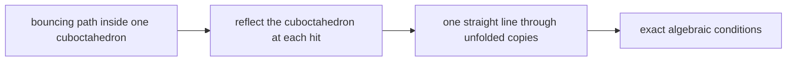
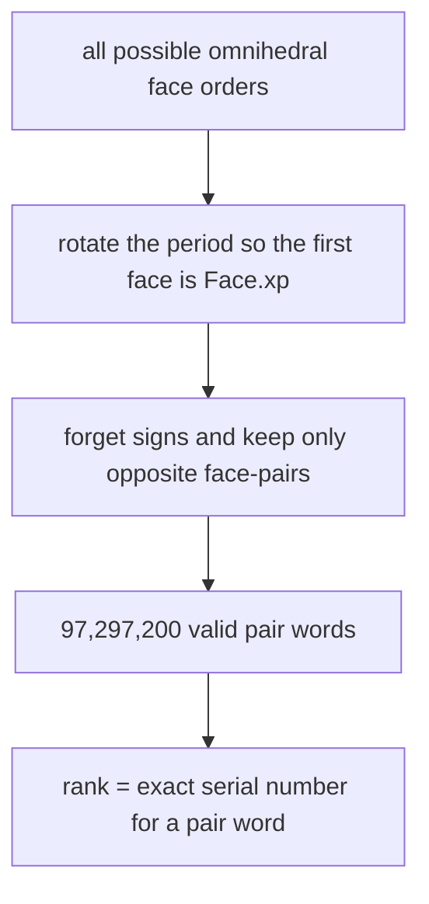
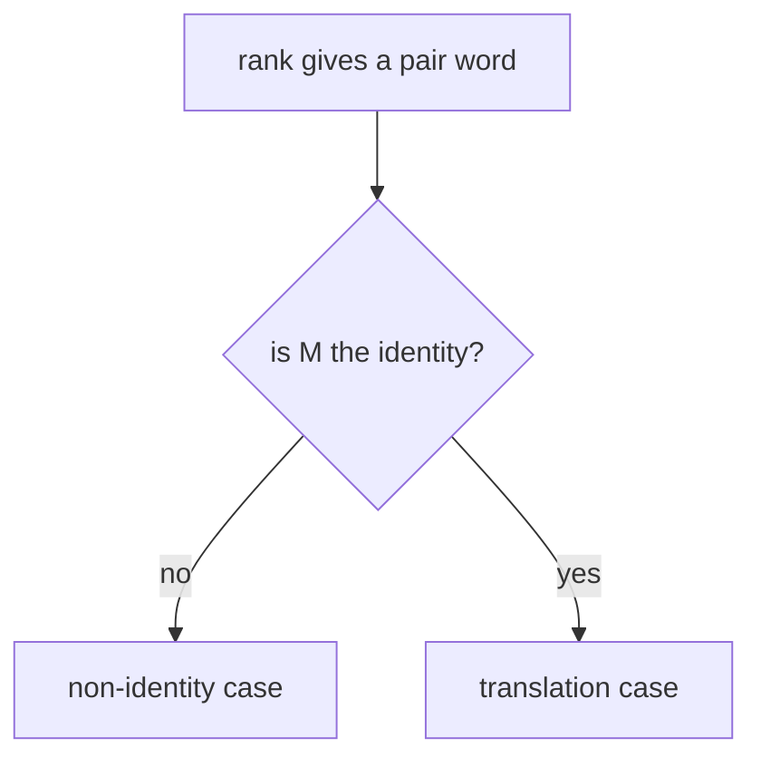
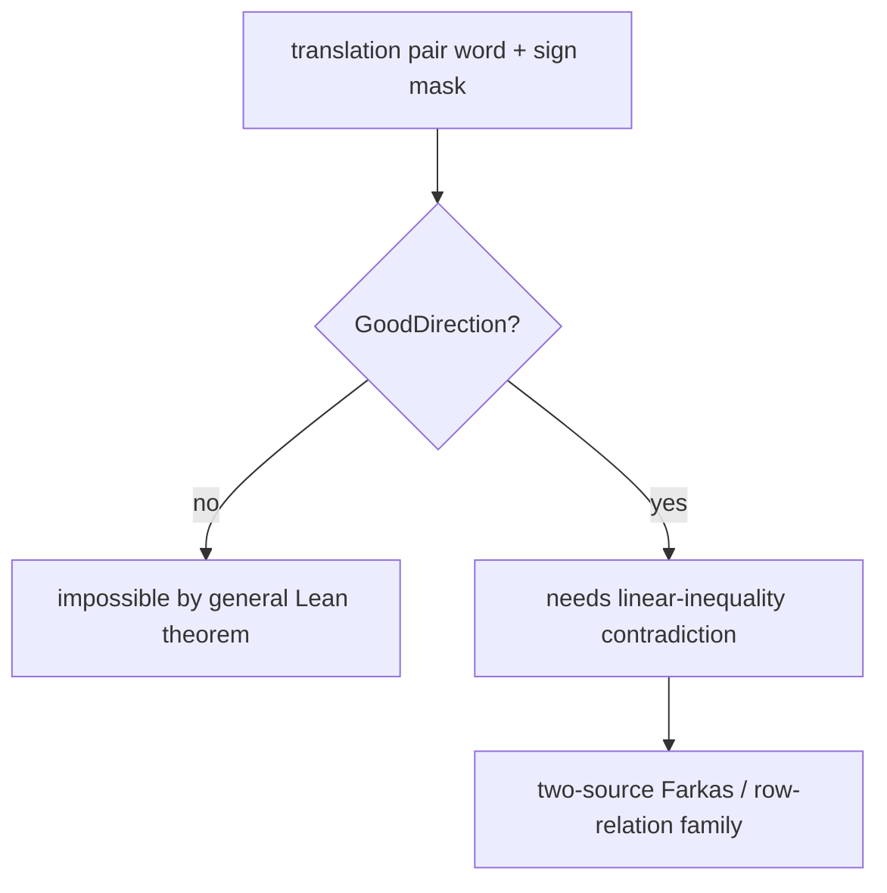
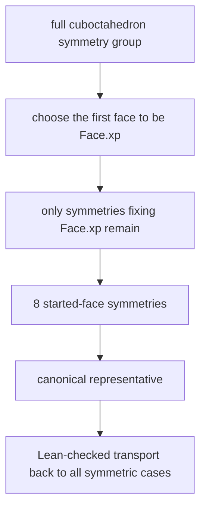
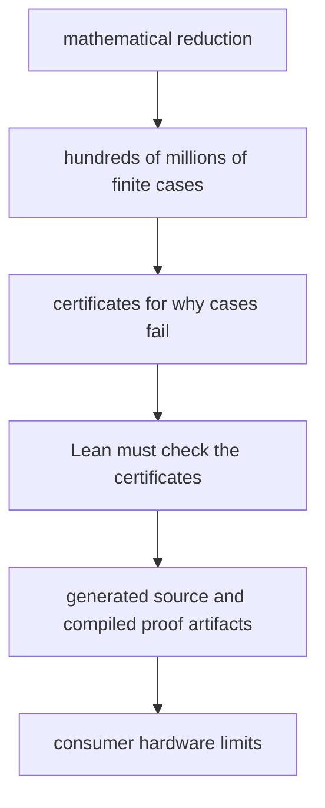
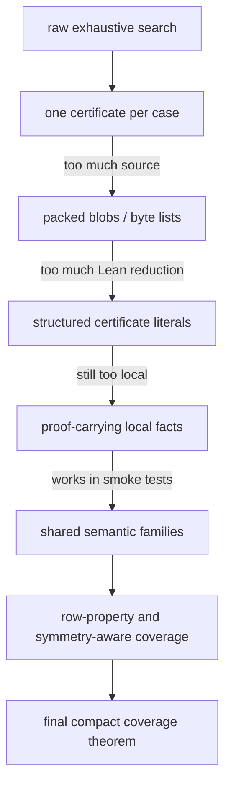
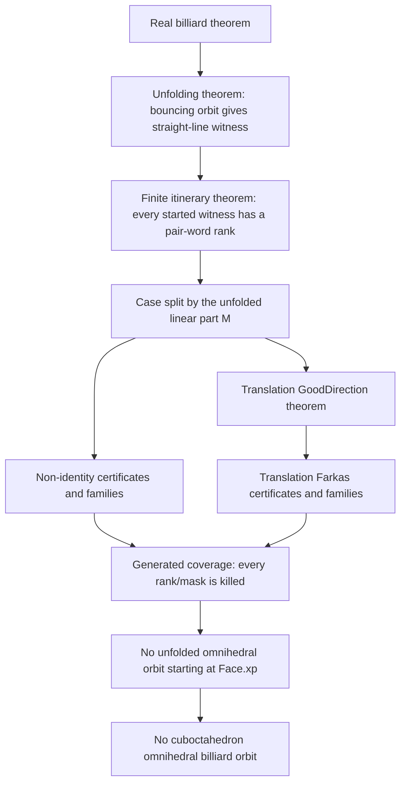
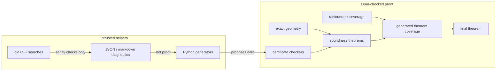

# Cuboctahedron Omnihedral Billiards

This repository is a Lean 4/mathlib project about one question:

```text
Can a billiard path inside a cuboctahedron bounce once off every face and then
repeat forever without ever hitting an edge or vertex?
```

The intended theorem says **no**.

The question is interesting because all five Platonic solids do admit
omnihedral billiard orbits, while the cuboctahedron is the next highly symmetric
solid one naturally tries. This project is building a proof that the
cuboctahedron behaves differently.

The proof is being built so that the final answer is not trusted because a
program searched many cases. The final answer should be trusted because Lean
checks:

- the geometry;
- the reduction from bouncing paths to straight lines;
- the complete finite enumeration of possible face orders;
- every generated obstruction certificate used to rule out those orders.

External Python and C++ code may help find patterns and certificates. It is
not part of the trusted proof.


## The Object

A **cuboctahedron** has 14 faces: 6 squares and 8 triangles. This project uses
the coordinate model

```text
P = { (x, y, z) :
      |x| <= 1, |y| <= 1, |z| <= 1,
      and +/-x +/-y +/-z <= 2 for all sign choices }.
```

The square faces are

```text
x = 1, x = -1, y = 1, y = -1, z = 1, z = -1.
```

The triangular faces are the eight planes

```text
+/-x +/-y +/-z = 2.
```

Each face is stored in Lean by a normal vector `n` and an offset `c`. The face
plane is `n dot p = c`. Because these numbers are integers, all reflection
calculations are exact rational arithmetic.

## The Billiard Trick

A billiard path normally bends at each bounce. The standard trick is to
**unfold** it.

Instead of reflecting the moving ball, reflect the room. After each impact,
copy the cuboctahedron across the hit face. In this unfolded world, the
billiard path is one straight line through reflected copies.



For any proposed order of faces

```text
F0, F1, ..., F13
```

Lean composes the corresponding reflections into one affine map

```text
A(p) = M p + b.
```

Here `M` is the linear part, and `b` is the translation part. A periodic orbit
with that face order can exist only if a straight line is compatible with this
single map.

## Why The Search Is Finite

An omnihedral orbit hits every face exactly once. If it exists, we can choose
where to call the period "the beginning." So the proof always starts the orbit
on one chosen square face, called `Face.xp`, the face `x = 1`.

After that choice, there are 13 remaining face hits to order. That is still a
large but finite problem.

The finite search is organized in two layers.

### Pair Words

Opposite faces have the same mirror direction. For example, `x = 1` and
`x = -1` are different faces, but their reflection matrices have the same
linear part. So the proof first records only which **opposite face-pair** is
hit.

A **pair word** is this length-13 list of face-pairs after starting at
`Face.xp`. It is not yet the full face itinerary, because it forgets the sign
inside each opposite pair.

After starting at `Face.xp`, a valid pair word must contain:

```text
x once,
y twice,
z twice,
and each of the four triangular opposite-pairs twice.
```

There are exactly

```text
13! / 2^6 = 97,297,200
```

valid pair words.

A **rank** is just a serial number for one of these pair words. Lean proves the
rank/unrank machinery, so a statement over all ranks means a statement over
all valid pair words, not over a list supplied by an external script.



### Sign Masks

In the translation case, the proof also has to choose which face in each
opposite pair is hit. A **sign mask** is a compact six-bit record of those
choices. Six bits give 64 possibilities.

So the raw translation branch is:

```text
identity-linear pair word + one of 64 sign masks.
```

The total number of translation sign assignments over all identity-linear pair
words is `157,957,632`.

## The Two Cases

For each pair word, Lean splits according to the linear part `M` of the
unfolded return map.



### Case 1: Non-Identity

If `M` is not the identity, any periodic straight line must lie on a special
axis of the affine map. This makes the possible orbit extremely rigid: the
direction, signed face choices, and often the starting point are forced.

Lean checks exact certificates showing that the forced candidate fails. Typical
failures are:

- there is no nonzero fixed direction;
- a required crossing direction points the wrong way;
- the forced signed face sequence is not actually omnihedral;
- the forced axis misses the interior of the starting face;
- the candidate hits the wrong face first;
- a hit lands outside the intended face interior.

The repository name for one such certificate is `NonIdCert`. The checker is
`checkNonIdCert`. The important theorem is not the checker itself, but its
soundness theorem: if Lean verifies the certificate, then no real unfolded
orbit exists for that case.

### Case 2: Translation

If `M` is the identity, the unfolded return map is a pure translation:

```text
A(p) = p + b.
```

The starting point on `Face.xp` has the form

```text
(1, y, z).
```

For a fixed pair word and sign mask, all crossing-order and face-interior
requirements become strict linear inequalities in the two unknowns `y` and
`z`.

The proof then uses a certificate of contradiction. The certificate gives
nonnegative rational multipliers for some of the inequalities. Lean checks
that, when those inequalities are added with those multipliers, the left side
cancels and the result is impossible.

This is a Farkas-style certificate. In plain language:

```text
If all these inequalities were true, their checked weighted sum would say
0 < a number that is <= 0.
```

That cannot happen, so the proposed orbit does not exist.

## Good Direction

A large part of the translation branch fails before needing a full Farkas
certificate. Some proposed signed itineraries would require the straight line
to cross a future face in the wrong direction.

For each internal impact, the exact formula for the crossing time has a
denominator. An **internal impact denominator** is this exact rational quantity
for one of the non-start, non-end crossings. A physically possible translation
orbit must have all these denominators positive.

The predicate `GoodDirection` means exactly that:

```text
every required internal crossing has the correct positive denominator.
```

The latest proof strategy proves in Lean:

```text
translation feasible -> GoodDirection.
```

This matters because bad-direction cases no longer need generated
certificates. They are eliminated by a general theorem. Generated translation
evidence only has to handle the surviving `GoodDirection` cases.



## Symmetry

The cuboctahedron has many symmetries. In the coordinate model, the full face
symmetry comes from permuting the coordinates and flipping signs. There are 48
such signed coordinate symmetries if orientation-reversing symmetries are
included.

These symmetries can turn one face itinerary into another equivalent itinerary.
If one case is impossible, its symmetric copies are impossible too.

However, after the proof chooses to start on `Face.xp`, not every symmetry is
still available. We may use only symmetries that keep `Face.xp` fixed. This
remaining started-face symmetry group has 8 elements: swap `y` and `z`, and
independently flip the signs of `y` and `z`. This is the symmetry group of the
square starting face.



Symmetry is a compression tool, not a trust shortcut. A symmetry-reduced proof
must still prove three things in Lean:

1. the symmetry sends faces, interiors, reflections, and feasibility conditions
   to the corresponding symmetric objects;
2. every raw case belongs to some symmetry orbit with a chosen representative;
3. the certificate for the representative transports to the raw case.

The repository has symmetry infrastructure in `PairWordSymmetry.lean` and
`Generated/Coverage/SymmetryTransport.lean`. The current final architecture
does not rely on unproved symmetry assumptions. If symmetry is used to reduce
generated data, Lean must check the transport and the coverage. If a branch is
not symmetry-compressed, it is still covered by the raw rank/unrank
enumeration.

That is why the proof can still be exhaustive: coverage ultimately means
"every rank, and every required sign mask, is killed," either directly or via a
Lean-checked transport from a symmetric representative.

## Generated Families

A naive proof would write down one certificate for every case. That is too big.
The current architecture uses families.

A **family** is a reusable reason that kills many cases at once. Instead of
saying "case 100 fails, case 101 fails, case 102 fails," a family theorem says
"every case with this exact structural pattern fails."

Some translation survivors are killed by very small Farkas contradictions. A
**Farkas support** is the small set of inequalities used in such a
contradiction. In the current two-source backend, a support often consists of
just two inequalities.

A **row-relation template** is a reusable algebraic pattern saying that two
rows of the linear inequality system always combine into a contradiction for a
whole family of cases. The word "row" just means one inequality in the system.

A **symbolic row family** is a collection of cases that share the same
proof-relevant row pattern, even if the raw numbers differ. A symbolic family
root is a generated Lean module that proves coverage for such families over
some range or sample.

These terms are engineering vocabulary for one idea:

```text
Find one exact reason that rules out many proposed orbits, then make Lean check
that the reason really applies to all of them.
```

## The Systems Problem

At first glance this is a problem in geometry. The mathematical idea is
beautifully compact: unfold the billiard, enumerate the possible face orders,
and prove that each order is impossible.

The hard part is that "enumerate the possible face orders" is not small.

The raw finite problem contains:

```text
97,297,200 pair words
157,957,632 translation sign assignments
```

Those numbers are not large by supercomputer standards, but they are large for
a formal proof. A normal search program can test a case, throw away its
temporary data, and keep a counter. Lean cannot merely be told that a program
did that. Lean needs a proof object, or a checked certificate, whose soundness
connects the computation back to the theorem.

That changes the engineering problem completely.



A naive formalization would emit one Lean proof or one Lean certificate for
each case. That is trustworthy in principle and unusable in practice: the
source tree becomes enormous, elaboration becomes slow, and memory usage can
explode. Other apparently compact approaches also failed. Packed byte strings
made source files smaller, but Lean still had to decode and check them. Giant
Boolean checkers moved the burden into kernel reduction. Splitting into small
chunks helped only until even the smallest meaningful chunk was too expensive.

So the project became a systems problem:

```text
How do we make a proof computation that is exact enough for Lean,
complete enough to cover every case,
small enough to build,
and predictable enough not to run out of memory?
```

The current target is deliberately "large workstation" rather than "cluster."
Some validation paths can still need tens of gigabytes of memory, and the
project currently treats roughly 64 GB of RAM as the practical upper bound. The
goal is not merely to finish eventually; it is to avoid proof-generation and
Lean-build strategies that take days, weeks, or months, or fail halfway through
with an out-of-memory error.

That is why the proof architecture emphasizes:

- exact rational and integer arithmetic, never floating point;
- small reusable soundness theorems instead of one-off giant reductions;
- semantic family theorems instead of raw per-case certificate arrays;
- generated roots that expose compact theorem statements;
- smoke tests on the heaviest expected generated leaves before scaling;
- bounded memory profiles and external build caches for generated evidence;
- rank/unrank coverage so compression never replaces exhaustiveness.

The evolution looks like this:



This is the unusual character of the project: the mathematical proof and the
build system are entangled. A proof strategy is not viable just because it is
logically correct. It also has to compile, cache, and replay on real hardware.
The current row-property and two-source Farkas work is an example of that
pressure: it is not just looking for nicer mathematics, but for theorem shapes
that let one checked argument cover many cases without making Lean materialize
millions of near-duplicate proof terms.

The trusted boundary remains the same throughout. Profilers and generators may
measure, discover, compress, and emit. They may be wrong. Lean must still check
the final family theorem and the final coverage theorem.

## Proof Architecture

The final proof has four layers.




Another way to view the trusted boundary:



## Does This Cover Everything?

The intended exhaustive argument is:

1. Any omnihedral orbit can be reindexed to start on `Face.xp`.
2. Any started omnihedral itinerary gives a valid pair word.
3. Every valid pair word has a unique rank below `numPairWords`.
4. For each rank, either the linear part is non-identity or it is identity.
5. In the non-identity branch, Lean-checked coverage kills the rank.
6. In the identity branch, every possible signed face choice is represented by
   one of 64 sign masks.
7. Bad-direction masks are impossible by the general `GoodDirection` theorem.
8. GoodDirection masks are killed by Lean-checked Farkas or family evidence.
9. Symmetry may reduce the amount of generated evidence only when Lean proves
   that representatives cover all symmetric raw cases.

So the proof does not depend on believing that "the sampled cases looked
covered." The final proof must contain a Lean-checkable coverage theorem whose
type says that all ranks and all required masks are handled.

## Current Status

The unconditional final theorem is not yet present. The trusted Lean bridge is
currently conditional on complete generated coverage:

```lean
theorem Cuboctahedron.conditional_cuboctahedron_no_omnihedral
    (coverage : ExhaustiveGeneratedCoverage) :
    ¬ exists o : BilliardOrbit14,
      o.Nonsingular /\ o.Periodic /\ o.TouchesEachFaceExactlyOnce
```

In plain language: if Lean is given a complete generated coverage witness, the
rest of the proof already reaches the real billiard theorem.

The newer generated API also defines `SemanticExhaustiveGeneratedCoverage`.
That is the current completion path: generated files should expose compact
semantic theorems saying cases are impossible, not huge public arrays of raw
certificates.

Recent diagnostics support the current translation-family direction:

- in the first `100,000` pair-word ranks, all `39,710` GoodDirection survivors
  were covered by row-relation templates in the diagnostic census;
- calibration windows covered `63,725` GoodDirection survivors with zero
  uncovered cases after the expanded row-template catalog;
- a representative symbolic row-family root covered `4,779` survivors using
  `126` symbolic families, but broader sampling is still needed before full
  generated emission.

These are promising diagnostics, not proof. The final step is to emit and check
the corresponding Lean coverage.

## Important Files

- `Cuboctahedron/Geometry/*`: exact faces, face interiors, reflections,
  billiard orbits, and unfolding.
- `Cuboctahedron/Search/Enumeration.lean`: pair-word ranking, unranking, and
  exact enumeration.
- `Cuboctahedron/Search/Certificates.lean`: non-identity and translation
  certificate checkers and their soundness theorems.
- `Cuboctahedron/Search/Farkas2D.lean`: the reusable strict linear-inequality
  contradiction theorem.
- `Cuboctahedron/Search/TranslationGoodDirection.lean`: the proof that any
  feasible translation orbit satisfies `GoodDirection`.
- `Cuboctahedron/Search/PairWordSymmetry.lean`: started-face symmetry group
  infrastructure.
- `Cuboctahedron/Generated/Coverage/SymmetryTransport.lean`: semantic symmetry
  transport adapters.
- `Cuboctahedron/Generated/ExhaustiveCoverage.lean`: generated coverage
  assembly types, including semantic coverage.
- `Cuboctahedron/Generated/Translation/TwoSource/*`: current two-source
  Farkas and support-family backend.
- `Cuboctahedron/ConditionalTheorem.lean`: the conditional bridge from complete
  coverage to the billiard theorem.

## Validation

For the current conditional proof surface:

```bash
lake build
grep -R "sorry\|admit\|axiom\|native_decide\|unsafe" Cuboctahedron || true
lake env lean Cuboctahedron/PrintConditionalAxioms.lean
```

When the unconditional final theorem is added, the final axiom check should be
the project target recorded in `AGENTS.md`:

```bash
lean Cuboctahedron/PrintAxioms.lean
```
