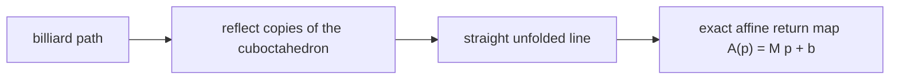
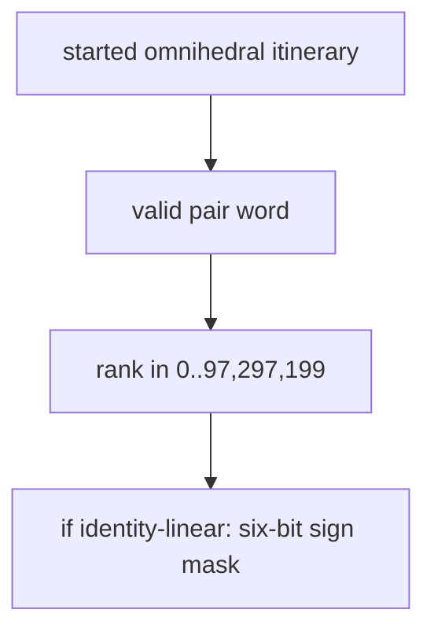
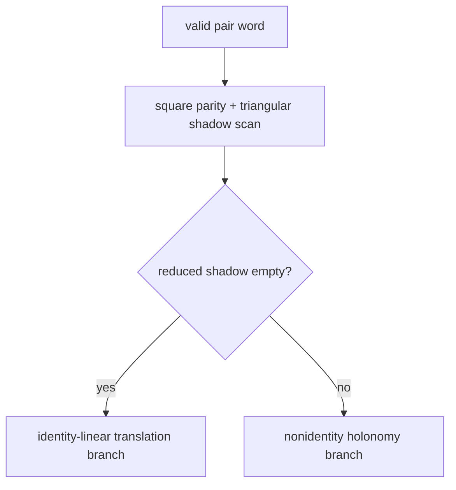
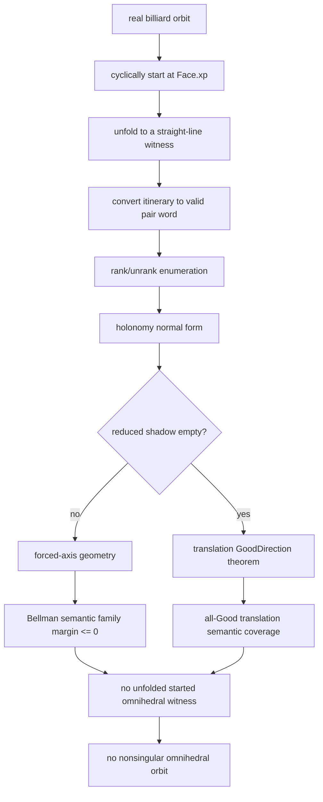

# Cuboctahedron Omnihedral Billiards

This is a Lean 4/mathlib project about one question:

```text
Can a nonsingular billiard path inside a cuboctahedron bounce once off every
face, return periodically, and then repeat forever?
```

The intended theorem says **no**.

The proof splits into two cases based on the structure of an affine map associated to each candidate billiard path. In one case, a novel holonomy normal form structural theorem rules out all possible paths. In the other case, all possible paths are ruled out by studying a Bellman potential flow on a certain finite graph. Together, these two arguments, each fully formalized in Lean 4, rule out all possible omnihedral paths in the cuboctahedron. As far as the author knows, this is a novel result in pure mathematics as of July 2026.

## Current Status

The public Lean theorem is currently conditional on complete generated
coverage:

```lean
theorem Cuboctahedron.conditional_cuboctahedron_no_omnihedral
    (coverage : ExhaustiveGeneratedCoverage) :
    Not (exists o : BilliardOrbit14,
      o.Nonsingular /\ o.Periodic /\ o.TouchesEachFaceExactlyOnce)
```

In plain language: if Lean is given complete generated coverage, the existing
hand-written bridge already proves the real billiard theorem.

The latest proof-engineering pivot is now checked in Lean: a holonomy normal
form classifies the linear return map of every valid started pair word.

```lean
theorem totalLinearOfPairWord_eq_identity_iff_reducedShadow_empty_of_valid
    {w : PairWord} (hvalid : ValidPairWord w) :
    totalLinearOfPairWord w = (matId : Mat3 Rat) <->
      reducedShadowOfPairWord w = []
```

So the identity/nonidentity split is no longer trusted as an external search
result. Lean proves it from exact square parity, a projective triangular
shadow, adjacent cancellation, and a mod-3 triangular product argument.

What remains is to emit and check complete semantic generated coverage over
the two normal-form branches.

The active nonidentity completion route is the **Bellman strategy**. Lean now
has a generic Bellman/potential theorem for integer transition gains, plus a
lightweight top-pairing language surface for the dominant residual family. The
intended generated proof is not a giant list of killed ranks. It is:

```text
semantic family language
  -> exact label-step run through a finite transition system
  -> integer potential bound
  -> nonpositive geometric obstruction margin
  -> no forced-axis witness
```

External scripts may discover the automaton, gains, and potential. Lean must
still check every transition inequality, the semantic language membership, and
the bridge from nonpositive margin to the billiard obstruction.

## Exact Model

The cuboctahedron is represented by rational inequalities:

```text
P = { (x, y, z) :
      |x| <= 1, |y| <= 1, |z| <= 1,
      and +/-x +/-y +/-z <= 2 for all sign choices }.
```

The square faces are:

```text
x = 1, x = -1, y = 1, y = -1, z = 1, z = -1.
```

The triangular faces are the eight planes:

```text
+/-x +/-y +/-z = 2.
```

Each face is stored by an exact normal vector `n` and offset `c`, so the face
plane is `n dot p = c`. Reflection in that plane is:

```text
r_F(p) = p - 2 * ((n dot p - c) / (n dot n)) * n.
```

All reflection data are rational. The proof code uses exact rational and
integer arithmetic, not floating-point approximations or epsilon thresholds.

## Unfolding

A billiard path bends at each reflection. The standard trick is to unfold the
room instead of the path.


For a proposed face order

```text
F0, F1, ..., F13
```

Lean composes the corresponding affine reflections into:

```text
A(p) = M p + b.
```

An unfolded billiard witness is a straight line through reflected copies of
the cuboctahedron. Periodicity forces the affine return map to carry that line
to itself, and the direction `v` must satisfy `M v = v`.



Since an omnihedral period hits every face once, the period can be cyclically
reindexed so that the first face is `Face.xp`, the square face `x = 1`.

## Finite Enumeration

After fixing the first face, the proof first forgets signs inside opposite
face pairs. There are seven opposite-face pairs:

```text
x, y, z, d111, d11m, d1m1, dm11
```

A valid started pair word has length 13 and multiplicities:

```text
x once,
y twice,
z twice,
and each of the four triangular opposite-pairs twice.
```

Lean proves the rank/unrank enumeration:

```text
13! / 2^6 = 97,297,200 valid started pair words.
```

A rank is only an address for one pair word. It is not the main compression
coordinate for the current proof.

In the identity-linear branch, the proof must also choose signs inside the
opposite pairs. There are six independent sign bits, hence 64 sign masks.



## Holonomy Normal Form

The active strategy is the holonomy-normal-form split.

Square-pair reflections `x`, `y`, and `z` are diagonal sign changes. The
normal form tracks their accumulated parity:

```text
(px, py, pz) in (Z/2Z)^3.
```

Triangular pair reflections are represented projectively by four triangular
letters:

```text
111, 11m, 1m1, m11
```

When a triangular reflection is scanned after square parity `p`, Lean appends
the parity-conjugated triangular letter to a shadow. Adjacent equal triangular
letters cancel. The final stack is `reducedShadowOfPairWord w`.

The exact product-order convention is:

```text
R(w[0]) * R(w[1]) * ... * R(w[12]) * R(x)
```

where the final `R(x)` is the started `Face.xp` pair reflection.

Lean proves:

```text
totalLinearOfPairWord w = I  iff  reducedShadowOfPairWord w = []
```

for every `ValidPairWord w`.

The proof has four pieces:

1. Valid pair-word counts force final square parity to be identity.
2. The scanner has a product invariant:
   `square-parity * triangular-reflection = acted-triangle * square-parity`.
3. Adjacent triangular cancellations preserve the triangular product.
4. A nonempty reduced triangular word cannot have identity product. The proof
   scales triangular reflection matrices by 3, reduces them modulo 3, and uses
   rank-one products over `ZMod 3`.

The external full scan that motivated this theorem found:

```text
empty reduced shadow:     2,468,088
nonempty reduced shadow: 94,829,112
```

Those counts were diagnostics only. The Lean classifier theorem is the trusted
split.



## Nonempty Shadow Branch

If the reduced shadow is nonempty, then the linear part `M` is not identity.
Any unfolded periodic line must have direction fixed by `M`, and the affine
return map must carry the whole line to itself. This forces an affine-axis
condition.

Typical exact obstructions are:

- no compatible nonzero fixed direction;
- forced crossing direction has the wrong sign;
- forced signed face sequence is not omnihedral;
- forced axis misses the interior of `Face.xp`;
- the candidate hits the wrong face first;
- a required impact lies outside the intended face interior.

The old backend described this primarily as coverage over nonidentity ranks.
The active route uses nonempty reduced shadows, primitive-axis signatures, and
forced-axis failure signatures as semantic family coordinates.

The public generated predicate remains small:

```lean
NonIdentityRankKilled r
```

It means: if rank `r` is nonidentity-linear, then no unfolded feasible witness
exists for that rank.

### Bellman residual strategy

The hard nonidentity residuals are no longer being treated primarily as
rank-interval certificate packing. The current route packages a residual
family as a closed semantic language and proves a margin bound for the whole
language.

For a residual family, geometry supplies an exact rational margin:

```text
feasible forced-axis witness -> margin > 0
```

A Bellman certificate proves the opposite:

```text
all accepted words in this semantic family -> scaled_margin <= 0
```

The generic Lean theorem is the usual potential argument. A transition has an
integer gain `g`, source state `s`, destination state `t`, and potential `V`.
If every transition satisfies

```text
g + V(t) <= V(s)
```

then gains telescope along a path. With a root bound and nonnegative final
potential, Lean proves the accumulated gain, and therefore the scaled margin,
is nonpositive.

The production-facing shape uses labels rather than raw edge lists:

```lean
BellmanLabelStepRun
BellmanLabelStepRunLanguageBound
scaledMargin_nonpos_of_bellmanLabelStepRunLanguageBound
```

In plain language: a generated family theorem should show that each accepted
signed face word steps through a small automaton with exact integer gains. The
potential proof kills every accepted word at once.

Current Bellman language work is centered on top-pairing residuals. The
checked language components include:

- cancellation-pairing membership;
- per-step signed-face schedule constraints;
- square-gap constraints;
- exact local-axis sign checks from prefix reflection matrices;
- canonical bad-face compatibility;
- signed sequence transport through `PairSignLanguageAtRank`.

The important boundary is that ranks are still addresses for final
exhaustiveness, but Bellman certificates should be organized by semantic
language families, not by lexicographic rank adjacency.

## Empty Shadow Branch

If the reduced shadow is empty, the linear part is identity and the affine
return map is a translation:

```text
A(p) = p + b.
```

For a fixed sign mask, the starting point on `Face.xp` has the form:

```text
(1, y, z).
```

The remaining crossing and face-interior conditions become strict rational
linear inequalities in `y` and `z`.

### GoodDirection

For an internal unfolded face plane

```text
u_i dot p = d_i
```

the crossing time along the translation direction is:

```text
t_i = (d_i - u_i dot p0) / (u_i dot b).
```

A feasible translation witness must cross every internal face in the correct
forward direction. Lean packages this necessary condition as:

```lean
GoodDirectionAtRank r mask
```

and proves:

```lean
goodDirection_of_translation_feasible_at_rank
```

In plain language:

```text
translation feasible -> GoodDirection.
```

So generated evidence should not enumerate masks that fail GoodDirection.
Those masks are impossible by a general theorem.

### Farkas and source-indexed rows

For GoodDirection survivors, the remaining constraints are strict rational
linear inequalities:

```text
a_j * y + c_j * z + e_j > 0.
```

Lean has a strict two-variable Farkas theorem. If nonnegative rational
multipliers cancel the `y` and `z` coefficients and leave a nonpositive
constant, the system is infeasible:

```text
sum q_j a_j = 0
sum q_j c_j = 0
sum q_j e_j <= 0
```

The current translation backend favors source-indexed rows. A row is described
by where it comes from geometrically, such as a start-face condition, an
ordering condition, or an impact-face interior condition. Many survivors are
killed by two-source Farkas contradictions.

### Walsh and integer-normalized evidence

The six sign bits can be viewed as variables in `{1, -1}`. For a fixed pair
word, internal denominators are degree-at-most-two Walsh polynomials in those
signs because both the unfolded normal and the translation vector are affine
sign expressions.

Walsh subcube bounds remain useful local evidence and diagnostics. The current
completion route, however, does not try to finish by raw sign-mask tiling.
Bounded exact audits showed that bad-direction masks are too irregular in
rank-mask coordinates. The preferred backend uses source-index/state
classifiers, row-producer families, and integer or homogeneous data where
possible, with small rational interpretation bridges checked once in Lean.

## Semantic Generated Coverage

The final generated layer should expose theorem-valued semantic statements,
not giant public arrays of certificate data.

The two public predicates are:

```lean
NonIdentityRankKilled r
TranslationCaseKilled r mask
```

`SemanticExhaustiveGeneratedCoverage` packages the final finite theorem:

1. every pair rank is covered by the enumeration address space;
2. every sign mask is covered by the finite mask address space;
3. every nonidentity rank is killed;
4. every translation rank and mask is killed.

For translation, the cleanest current route is all-Good coverage:

```lean
PublicAllGoodSemanticCoverageIntervals
semanticGeneratedCoverageOfAllGoodIntervals
```

Generated files prove that every identity-linear GoodDirection survivor is
killed. The GoodDirection theorem then turns that into ordinary translation
coverage.

Intervals `[lo, hi)` still appear in the public assembly API, but only as an
exhaustive assembly device. The proof-search compression coordinate is now
holonomy state and semantic family data, not lexicographic rank adjacency.

## Proof Flow



## Trusted and Untrusted Boundaries

Trusted by the final proof:

- Lean definitions of the cuboctahedron, faces, reflections, and unfolding;
- rank/unrank enumeration theorems;
- holonomy normal-form classifier;
- GoodDirection theorem;
- Farkas and certificate soundness theorems;
- generated semantic coverage theorems checked by Lean.

Not trusted as proof:

- Python profilers and generators;
- old C++ searches;
- JSON and markdown diagnostics;
- claims about coverage unless reified as Lean theorems.

## Important Files

- `Cuboctahedron/Geometry/*`: exact faces, reflections, billiard orbits, and
  unfolding.
- `Cuboctahedron/Search/Enumeration.lean`: pair-word ranking, unranking, and
  exact enumeration.
- `Cuboctahedron/Search/Itineraries.lean`: reduction from started omnihedral
  face sequences to pair words.
- `Cuboctahedron/Search/ShadowNormalForm.lean`: square parity, triangular
  letters, shadow scan, and reduced stack definitions.
- `Cuboctahedron/Search/ShadowNormalFormCounts.lean`: valid pair-word counts
  imply trivial final square parity.
- `Cuboctahedron/Search/ShadowNormalFormLinear.lean`: product-order bridge to
  `totalLinearOfPairWord`.
- `Cuboctahedron/Search/ShadowNormalFormMod3.lean`: finite-field triangular
  product core and no-adjacent reduced-stack invariant.
- `Cuboctahedron/Search/ShadowNormalFormScaled.lean`: integer-scaled
  triangular products and rational nonidentity bridge.
- `Cuboctahedron/Search/ShadowNormalFormProduct.lean`: square/triangular
  product decomposition.
- `Cuboctahedron/Search/ShadowNormalFormClassifier.lean`: identity iff empty
  reduced shadow.
- `Cuboctahedron/Search/BellmanPotential.lean`: generic integer
  Bellman/potential path and label-step theorems.
- `Cuboctahedron/Search/BellmanTopPairingLanguage.lean`: lightweight semantic
  language surface for the current top-pairing Bellman residual family.
- `Cuboctahedron/Search/NonIdentityCase.lean`: forced-axis nonidentity
  geometry and certificate soundness.
- `Cuboctahedron/Search/TranslationGoodDirection.lean`: proof that feasible
  translation witnesses satisfy `GoodDirection`.
- `Cuboctahedron/Search/Farkas2D.lean`: strict two-variable rational Farkas
  obstruction.
- `Cuboctahedron/Search/TwoSourceFarkas.lean`: source-indexed two-row Farkas
  support checker.
- `Cuboctahedron/Generated/Coverage/Predicates.lean`: semantic killed
  predicates.
- `Cuboctahedron/Generated/NonIdentity/Residual/BellmanTopPairingClosedLanguageGeneratedTraceSmoke.lean`:
  generated-style smoke for the closed Bellman language trace surface.
- `Cuboctahedron/Generated/Coverage/TranslationSurvivors.lean`: adapter from
  GoodDirection-only translation evidence to ordinary translation coverage.
- `Cuboctahedron/Generated/ExhaustiveCoverage.lean`: semantic exhaustive
  coverage packages and public interval adapters.
- `Cuboctahedron/ConditionalTheorem.lean`: conditional bridge from complete
  coverage to the billiard theorem.
- `docs/holonomy_pivot_repo_notes.md`: repository names and conventions for
  the holonomy pivot.
- `docs/shadow_normal_form_report.md`: exact external scan results and Lean
  checkpoint history.
- `docs/nonidentity_residual_axis_profile_report.md`: Bellman pivot history,
  diagnostic state choices, and accepted/rejected proof surfaces.
- `scripts/emit_bellman_closed_language_trace_smoke.py`: emits the current
  closed-language Bellman trace smoke shard.
- `scripts/run_bellman_safe_smoke.py`: strict allowlisted runner for small
  Bellman generated smokes; this is operational safety tooling, not proof.
- `SYMMETRY_PLAN.md`: long-running strategy log and gated proof-engineering
  plan.
- `paper/cuboctahedron_no_omnihedral.tex`: paper-style overview of the current
  strategy, including the Bellman certificate route.

## Validation

For the current conditional proof surface:

```bash
lake build
grep -R "sorry\|admit\|axiom\|native_decide\|unsafe" Cuboctahedron || true
lake env lean Cuboctahedron/PrintConditionalAxioms.lean
```

When the unconditional final theorem is installed, the final axiom check should
be:

```bash
lean Cuboctahedron/PrintAxioms.lean
```

For current small Bellman generated smokes, use the guard wrapper rather than
an unguarded broad build:

```bash
python3 scripts/run_bellman_safe_smoke.py --json /tmp/bellman_safe_smoke.json
```

The wrapper intentionally allows only known small Bellman targets and enforces
strict memory and timeout caps.

## Development Rule of Thumb

Ranks are for exhaustiveness. They should not be treated as the main
compression coordinate for new generated evidence.

The current direction is:

```text
holonomy state -> semantic family language -> Bellman/Farkas theorem -> Lean-checked coverage
```

Every generated datum may be wrong until Lean checks the theorem that consumes
it.
